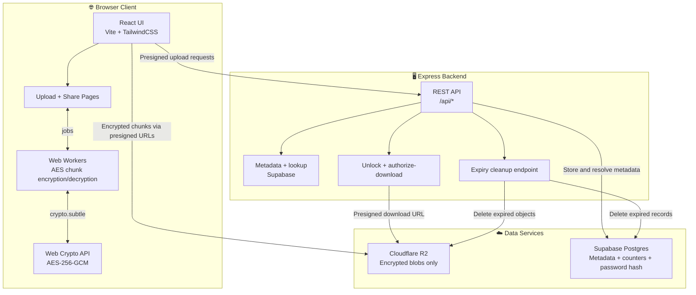
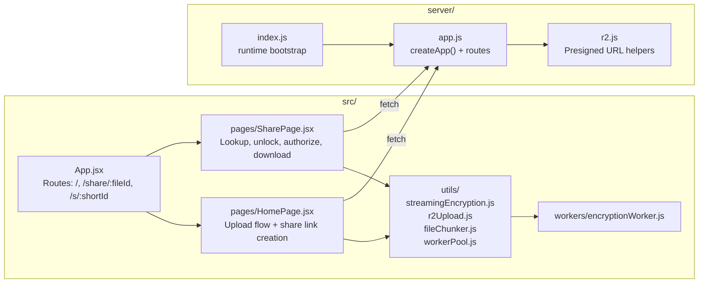
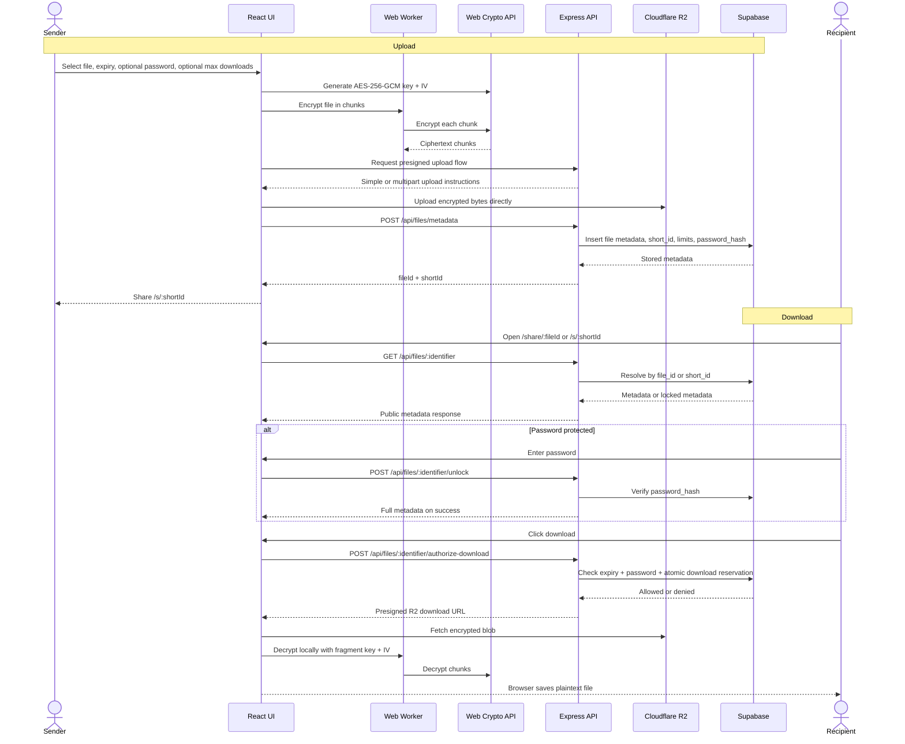
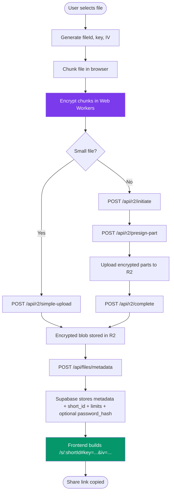
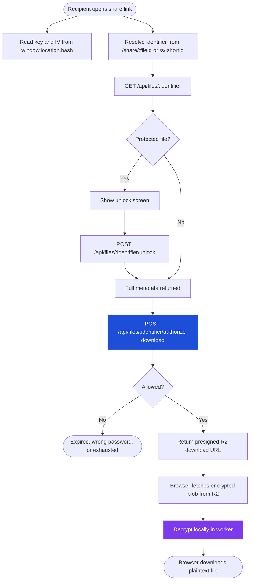
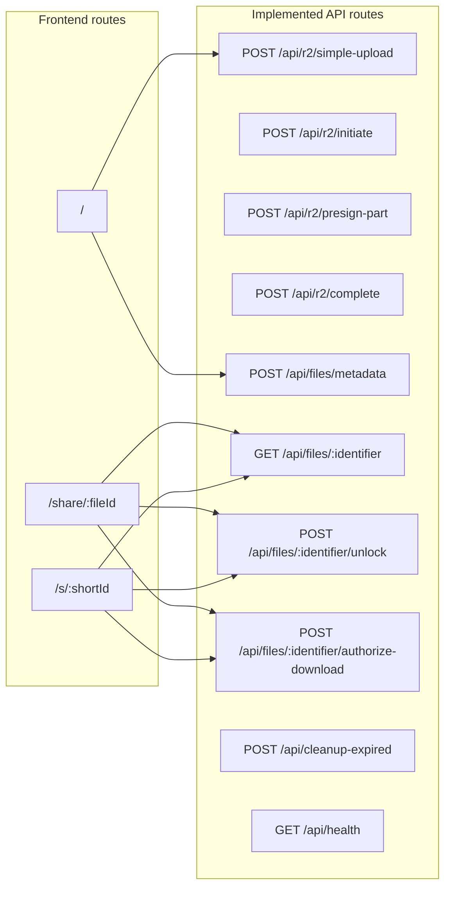
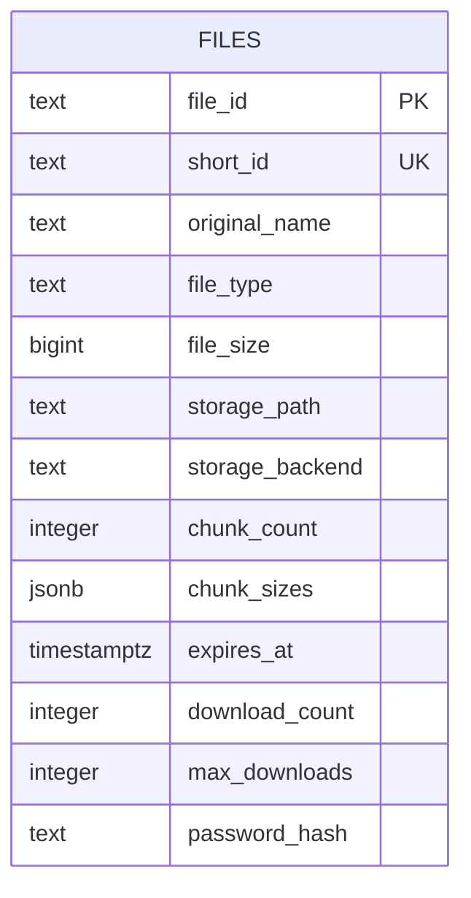
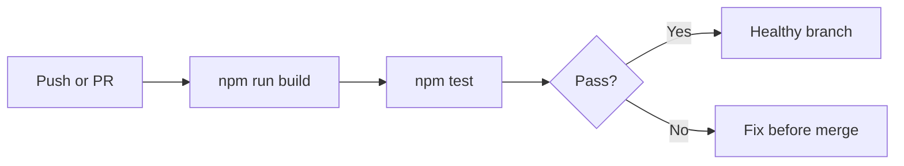

<div align="center">

# 🔒 MaskedFile

### Zero-knowledge encrypted file sharing with browser-side encryption, Cloudflare R2 storage, short links, download limits, and password-protected access.

[](https://opensource.org/licenses/MIT)
[](https://nodejs.org/)
[](https://react.dev/)
[](https://vitejs.dev/)
[](https://tailwindcss.com/)
[](https://supabase.com/)
[](https://developers.cloudflare.com/r2/)
[](./test)

</div>

---

## 📖 Overview

**MaskedFile** is a zero-knowledge file-sharing platform. Files are encrypted in the browser with **AES-256-GCM** before upload, and the decryption key never reaches the server. The backend stores only ciphertext in **Cloudflare R2** and metadata in **Supabase**.

The current implementation also adds:

- 🔗 **Short share links** with `/s/:shortId`
- 🔐 **Optional password protection** before a download can be authorized
- 🎯 **Atomic download limits** enforced server-side
- ⏱️ **Expiry-based cleanup** for stale shares
- ⚡ **Chunked worker-based encryption** for large-file support

### ✨ Key Highlights

- **Zero-knowledge by default**: the URL fragment carries `#key` and `#iv`, which are never sent in HTTP requests
- **Direct-to-R2 upload pipeline**: the browser uploads encrypted chunks using presigned URLs
- **Server-controlled download authorization**: clients cannot bypass download limits through old direct-download routes
- **Multiple share identifiers**: both `/share/:fileId` and `/s/:shortId` are supported
- **Automated test stack**: Vitest, React Testing Library, and Supertest cover the highest-risk flows

---

## 🏗️ Architecture

### High-Level System Architecture


```mermaid
graph TB
    subgraph Client["🌐 Browser Client"]
        UI["React UI<br/>Vite + TailwindCSS"]
        PAGES["Upload + Share Pages"]
        WORKERS["Web Workers<br/>AES chunk encryption/decryption"]
        CRYPTO["Web Crypto API<br/>AES-256-GCM"]
        UI --> PAGES
        PAGES <-->|jobs| WORKERS
        WORKERS <-->|crypto.subtle| CRYPTO
    end

    subgraph Server["🖥️ Express Backend"]
        API["REST API<br/>/api/*"]
        META["Metadata + lookup<br/>Supabase"]
        AUTH["Unlock + authorize-download"]
        CLEAN["Expiry cleanup endpoint"]
        API --> META
        API --> AUTH
        API --> CLEAN
    end

    subgraph Storage["☁️ Data Services"]
        R2["Cloudflare R2<br/>Encrypted blobs only"]
        DB["Supabase Postgres<br/>Metadata + counters + password hash"]
    end

    UI -->|"Presigned upload requests"| API
    UI -->|"Encrypted chunks via presigned URLs"| R2
    API -->|"Store and resolve metadata"| DB
    AUTH -->|"Presigned download URL"| R2
    CLEAN -->|"Delete expired objects"| R2
    CLEAN -->|"Delete expired records"| DB
```

### Current Component Breakdown


```mermaid
graph LR
    subgraph Frontend["src/"]
        direction TB
        APP["App.jsx<br/>Routes: /, /share/:fileId, /s/:shortId"]
        HOME["pages/HomePage.jsx<br/>Upload flow + share link creation"]
        SHARE["pages/SharePage.jsx<br/>Lookup, unlock, authorize, download"]
        UTILS["utils/<br/>streamingEncryption.js<br/>r2Upload.js<br/>fileChunker.js<br/>workerPool.js"]
        WKR["workers/encryptionWorker.js"]
        APP --> HOME
        APP --> SHARE
        HOME --> UTILS
        SHARE --> UTILS
        UTILS --> WKR
    end

    subgraph Backend["server/"]
        direction TB
        APPJS["app.js<br/>createApp() + routes"]
        INDEX["index.js<br/>runtime bootstrap"]
        R2JS["r2.js<br/>Presigned URL helpers"]
        APPJS --> R2JS
        INDEX --> APPJS
    end

    SHARE -->|"fetch"| APPJS
    HOME -->|"fetch"| APPJS
```

---

## 🔐 Security & Trust Model

### Upload and Download Lifecycle


```mermaid
sequenceDiagram
    actor Sender
    participant UI as React UI
    participant Worker as Web Worker
    participant Crypto as Web Crypto API
    participant API as Express API
    participant R2 as Cloudflare R2
    participant DB as Supabase
    actor Recipient

    Note over Sender,DB: Upload

    Sender->>UI: Select file, expiry, optional password, optional max downloads
    UI->>Crypto: Generate AES-256-GCM key + IV
    UI->>Worker: Encrypt file in chunks
    Worker->>Crypto: Encrypt each chunk
    Crypto-->>Worker: Ciphertext chunks
    UI->>API: Request presigned upload flow
    API-->>UI: Simple or multipart upload instructions
    UI->>R2: Upload encrypted bytes directly
    UI->>API: POST /api/files/metadata
    API->>DB: Insert file metadata, short_id, limits, password_hash
    DB-->>API: Stored metadata
    API-->>UI: fileId + shortId
    UI-->>Sender: Share /s/:shortId#key=...&iv=...

    Note over Recipient,DB: Download

    Recipient->>UI: Open /share/:fileId or /s/:shortId
    UI->>API: GET /api/files/:identifier
    API->>DB: Resolve by file_id or short_id
    DB-->>API: Metadata or locked metadata
    API-->>UI: Public metadata response
    alt Password protected
        Recipient->>UI: Enter password
        UI->>API: POST /api/files/:identifier/unlock
        API->>DB: Verify password_hash
        API-->>UI: Full metadata on success
    end
    Recipient->>UI: Click download
    UI->>API: POST /api/files/:identifier/authorize-download
    API->>DB: Check expiry + password + atomic download reservation
    DB-->>API: Allowed or denied
    API-->>UI: Presigned R2 download URL
    UI->>R2: Fetch encrypted blob
    UI->>Worker: Decrypt locally with fragment key + IV
    Worker->>Crypto: Decrypt chunks
    UI-->>Recipient: Browser saves plaintext file
```

### Why the Server Still Cannot Decrypt Files

| The server stores or checks | The server never receives |
|---|---|
| Encrypted chunks in R2 | Plaintext file content |
| File metadata in Supabase | AES key from the URL fragment |
| Optional `password_hash` | Raw decryption key material |
| Download counters and expiry timestamps | The `#key` and `#iv` fragment values in HTTP requests |
| Presigned URL issuance rules | The final plaintext generated in the browser |

> **Important:** Password protection is an extra access gate. It does not replace client-side encryption, and it does not give the server the decryption key.

---

## 🌊 Current Data Flows

### Upload Flow


```mermaid
flowchart TD
    A([User selects file]) --> B[Generate fileId, key, IV]
    B --> C[Chunk file in browser]
    C --> D[Encrypt chunks in Web Workers]
    D --> E{Small file?}
    E -->|Yes| F[POST /api/r2/simple-upload]
    E -->|No| G[POST /api/r2/initiate]
    G --> H[POST /api/r2/presign-part]
    H --> I[Upload encrypted parts to R2]
    I --> J[POST /api/r2/complete]
    F --> K[Encrypted blob stored in R2]
    J --> K
    K --> L[POST /api/files/metadata]
    L --> M[Supabase stores metadata + short_id + limits + optional password_hash]
    M --> N[Frontend builds /s/:shortId#key=...&iv=...]
    N --> O([Share link copied])

    style D fill:#7c3aed,color:#fff
    style N fill:#059669,color:#fff
```

### Download Flow


```mermaid
flowchart TD
    A([Recipient opens share link]) --> B[Read key and IV from window.location.hash]
    A --> C[Resolve identifier from /share/:fileId or /s/:shortId]
    C --> D[GET /api/files/:identifier]
    D --> E{Protected file?}
    E -->|Yes| F[Show unlock screen]
    F --> G[POST /api/files/:identifier/unlock]
    G --> H[Full metadata returned]
    E -->|No| H
    H --> I[POST /api/files/:identifier/authorize-download]
    I --> J{Allowed?}
    J -->|No| K([Expired, wrong password, or exhausted])
    J -->|Yes| L[Return presigned R2 download URL]
    L --> M[Browser fetches encrypted blob from R2]
    M --> N[Decrypt locally in worker]
    N --> O([Browser downloads plaintext file])

    style I fill:#1d4ed8,color:#fff
    style N fill:#7c3aed,color:#fff
```

### Route Surface


```mermaid
flowchart LR
    subgraph FrontendRoutes["Frontend routes"]
        R1["/"]
        R2["/share/:fileId"]
        R3["/s/:shortId"]
    end

    subgraph ApiRoutes["Implemented API routes"]
        A1["POST /api/r2/simple-upload"]
        A2["POST /api/r2/initiate"]
        A3["POST /api/r2/presign-part"]
        A4["POST /api/r2/complete"]
        A5["POST /api/files/metadata"]
        A6["GET /api/files/:identifier"]
        A7["POST /api/files/:identifier/unlock"]
        A8["POST /api/files/:identifier/authorize-download"]
        A9["POST /api/cleanup-expired"]
        A10["GET /api/health"]
    end

    R1 --> A1
    R1 --> A5
    R2 --> A6
    R2 --> A7
    R2 --> A8
    R3 --> A6
    R3 --> A7
    R3 --> A8
```

---

## 🗄️ Data Model

The `files` table stores metadata only. Ciphertext is stored in Cloudflare R2.


```mermaid
erDiagram
    FILES {
        text file_id PK
        text short_id UK
        text original_name
        text file_type
        bigint file_size
        text storage_path
        text storage_backend
        integer chunk_count
        jsonb chunk_sizes
        timestamptz expires_at
        integer download_count
        integer max_downloads
        text password_hash
    }
```

### Tracked SQL scripts

- `scripts/phase1_link_shortening.sql`
- `scripts/phase2_download_limits.sql`
- `scripts/phase3_password_protection.sql`

---

## 📁 Project Structure

```text
secure-share/
├── .github/
│   └── workflows/
│       ├── cleanup-expired.yml
│       └── tests.yml
├── docs/
│   └── archive/
├── scripts/
│   ├── phase1_link_shortening.sql
│   ├── phase2_download_limits.sql
│   └── phase3_password_protection.sql
├── server/
│   ├── app.js
│   ├── index.js
│   └── r2.js
├── src/
│   ├── components/
│   ├── context/
│   ├── pages/
│   ├── utils/
│   ├── workers/
│   ├── App.jsx
│   └── main.jsx
├── test/
│   ├── frontend/
│   ├── server/
│   └── setup/
├── architecture.md
├── STREAMING_SETUP.md
├── vitest.config.js
└── package.json
```

---

## 🛠️ Tech Stack

| Layer | Technology | Purpose |
|---|---|---|
| Frontend | [React 18](https://react.dev/) + [Vite](https://vitejs.dev/) | UI, routing, dev/build tooling |
| Styling | [TailwindCSS 3](https://tailwindcss.com/) | Utility-first CSS |
| Encryption | [Web Crypto API](https://developer.mozilla.org/en-US/docs/Web/API/Web_Crypto_API) | AES-256-GCM in the browser |
| Worker execution | [Web Workers](https://developer.mozilla.org/en-US/docs/Web/API/Web_Workers_API) | Off-main-thread chunk encryption/decryption |
| Backend | [Express.js](https://expressjs.com/) + [Node.js](https://nodejs.org/) | Presigned URL issuance, metadata, authorization, cleanup |
| Object storage | [Cloudflare R2](https://developers.cloudflare.com/r2/) | Encrypted object storage |
| Metadata store | [Supabase](https://supabase.com/) | PostgreSQL metadata, counters, RPC-backed authorization |
| Password hashing | [bcrypt](https://www.npmjs.com/package/bcrypt) | Optional password protection |
| Tests | [Vitest](https://vitest.dev/), [React Testing Library](https://testing-library.com/), [Supertest](https://www.npmjs.com/package/supertest) | Frontend and backend automated coverage |

---

## ⚙️ Local Development

### Prerequisites

- **Node.js** 18+
- **npm** 9+
- A **Cloudflare R2** bucket
- A **Supabase** project

### Install dependencies

```bash
npm install
```

### Start the frontend only

```bash
npm run dev
```

### Start the backend only

```bash
npm run server
```

### Start both together

```bash
npm run dev:full
```

Expected local ports:

- Frontend: `http://localhost:5173`
- Backend: `http://localhost:3000`

---

## 🔑 Environment Variables

| Variable | Used by | Notes |
|---|---|---|
| `VITE_SUPABASE_URL` | Frontend + backend | Supabase project URL |
| `VITE_SUPABASE_ANON_KEY` | Frontend | Public anon key used by the client |
| `SUPABASE_SERVICE_KEY` | Backend | Service-role key for metadata operations |
| `R2_ACCOUNT_ID` | Backend | Cloudflare account ID |
| `R2_ACCESS_KEY_ID` | Backend | R2 access key |
| `R2_SECRET_ACCESS_KEY` | Backend | R2 secret key |
| `R2_BUCKET_NAME` | Backend | Bucket name for encrypted objects |
| `PORT` | Backend | Defaults to `3000` |
| `CLEANUP_SECRET` | Backend | Required by `POST /api/cleanup-expired` via `x-cleanup-secret` |

---

## 🧪 Testing

### Automated tests

```bash
npm test
```

### Watch mode

```bash
npm run test:watch
```

### Coverage

```bash
npm run test:coverage
```

Current automated coverage includes:

- Short-link creation and identifier lookup
- Password-protected metadata and unlock behavior
- Atomic download authorization and limit exhaustion
- Share page regression coverage for protected-file rendering

Manual smoke checks are still recommended for:

- Real upload/download flows against your live Supabase + R2 setup
- Expiry cleanup behavior over time
- Cross-browser download behavior for larger files

---

## 🚀 Deployment and Operations

### CI validation


```mermaid
flowchart LR
    PR["Push or PR"] --> BUILD["npm run build"]
    BUILD --> TEST["npm test"]
    TEST --> PASS{Pass?}
    PASS -->|Yes| GREEN["Healthy branch"]
    PASS -->|No| RED["Fix before merge"]
```

### Cleanup behavior

- Expired files are removed through `POST /api/cleanup-expired`
- The endpoint requires `x-cleanup-secret`
- Exhausted downloads are blocked immediately by authorization logic
- Physical deletion of exhausted files is **best-effort delayed cleanup**, not a hard transactional guarantee

---

## ⚠️ Current Limitations

- Multiple file upload and ZIP packaging are not implemented yet
- There is no browser E2E suite yet
- Tests use mocks for Supabase and R2 rather than live external services
- The old direct `GET /api/r2/download/*` route is intentionally disabled so download limits cannot be bypassed

---

## 📚 Supporting Docs

- [architecture.md](./architecture.md)
- [STREAMING_SETUP.md](./STREAMING_SETUP.md)
- Historical docs live in [docs/archive/](./docs/archive/)

---

## 📄 License

This project is licensed under the **MIT License**. See [LICENSE](./LICENSE).

---

<div align="center">
  <sub>Built with 🔐 by <a href="https://github.com/Basit-Ali0">Basit-Ali0</a></sub>
</div>
