<div align="center">

# 🔒 MaskedFile

### Zero-knowledge encrypted file sharing — your files are encrypted before they ever leave your browser.

[](https://opensource.org/licenses/MIT)
[](https://nodejs.org/)
[](https://react.dev/)
[](https://vitejs.dev/)
[](https://tailwindcss.com/)
[](https://supabase.com/)
[](https://developers.cloudflare.com/r2/)

</div>

---

## 📖 Overview

**MaskedFile** is a zero-knowledge, end-to-end encrypted file sharing platform. Files are encrypted in the browser using **AES-256-GCM** via the Web Crypto API — the server only ever receives ciphertext and never has access to your plaintext data or encryption keys. Decryption keys are embedded in the share link as a URL fragment (`#key`), which is never sent to the server.

### ✨ Key Highlights

- 🔐 **Zero-knowledge architecture** — AES-256-GCM client-side encryption; the server sees only ciphertext
- 📦 **Large file support** — Streaming encrypt → upload → download pipeline handles files up to **5 GB**
- ⏱️ **Auto-expiry** — Files are automatically purged after a user-chosen duration
- 🔗 **No account required** — Generate a shareable link with the decryption key embedded in the fragment
- 🌍 **Global delivery** — Cloudflare R2 for fast, distributed storage
- ⚡ **Non-blocking UI** — Encryption runs in a dedicated **Web Worker** thread

---

## 🏗️ Architecture

### High-Level System Architecture


### Component Breakdown

```mermaid
graph LR
    subgraph Frontend["src/ (React + Vite)"]
        direction TB
        PAGES["pages/\nUpload · Download · Home"]
        COMP["components/\nDropzone · ProgressBar\nShareCard · ExpiryPicker"]
        HOOKS["hooks/\nuseEncryption · useUpload\nuseDownload"]
        WORKER["workers/\ncrypto.worker.js"]
        API_CLIENT["lib/api.js\n(fetch wrapper)"]
        PAGES --> COMP
        PAGES --> HOOKS
        HOOKS --> WORKER
        HOOKS --> API_CLIENT
    end

    subgraph Backend["server/ (Express.js)"]
        direction TB
        ROUTES["routes/\nfiles.js · health.js"]
        CTRL["controllers/\nupload · download · delete"]
        SERVICES["services/\nr2.js · supabase.js"]
        SCHED["scheduler/\nexpiry.js"]
        ROUTES --> CTRL --> SERVICES
        SCHED --> SERVICES
    end

    API_CLIENT -->|"HTTP/HTTPS"| ROUTES
```



---

## 🔐 Encryption & Security Model

### End-to-End Encryption Flow

```mermaid
sequenceDiagram
    actor User
    participant UI as React UI
    participant WW as Web Worker
    participant WCAPI as Web Crypto API
    participant Server as Express Server
    participant R2 as Cloudflare R2
    participant DB as Supabase DB

    Note over User,DB: ── UPLOAD ──────────────────────────────────────────

    User->>UI: Selects file + expiry duration
    UI->>WW: postMessage({ file, action: 'encrypt' })
    WW->>WCAPI: crypto.subtle.generateKey(AES-GCM, 256)
    WCAPI-->>WW: CryptoKey (never leaves browser)
    WW->>WCAPI: crypto.subtle.exportKey('raw', key)
    WCAPI-->>WW: keyBytes (base64url encoded)
    WW->>WCAPI: crypto.subtle.encrypt(AES-GCM, key, chunk)
    Note over WW: Streams file in chunks, encrypts each
    WCAPI-->>WW: encryptedChunks + IV
    WW-->>UI: { encryptedBlob, iv, keyBase64 }
    UI->>Server: POST /api/files (multipart, encrypted blob + IV + expiry)
    Server->>R2: Upload ciphertext blob
    R2-->>Server: storageKey
    Server->>DB: INSERT { id, iv, size, expiry, storageKey }
    DB-->>Server: fileId
    Server-->>UI: { fileId }
    UI-->>User: Share link: https://app.url/d/{fileId}#keyBase64
    Note over User: Key is in the URL fragment — NEVER sent to server

    Note over User,DB: ── DOWNLOAD ─────────────────────────────────────────

    User->>UI: Opens share link
    UI->>UI: Extract key from window.location.hash
    UI->>Server: GET /api/files/:fileId (no key!)
    Server->>DB: SELECT metadata WHERE id = fileId
    DB-->>Server: { iv, storageKey, expiry }
    Server->>R2: GetObject(storageKey) — stream
    R2-->>Server: Encrypted stream
    Server-->>UI: Encrypted stream (chunked transfer)
    UI->>WW: postMessage({ stream, iv, keyBase64, action: 'decrypt' })
    WW->>WCAPI: crypto.subtle.importKey(keyBytes)
    WW->>WCAPI: crypto.subtle.decrypt(AES-GCM, key, chunk)
    WCAPI-->>WW: plaintext chunks
    WW-->>UI: decryptedBlob
    UI-->>User: Browser downloads plaintext file
```



### Why the Server Never Sees Your Data

| What the server stores | What the server never sees |
|---|---|
| Encrypted ciphertext | Plaintext file content |
| Initialization Vector (IV) | AES encryption key |
| File size, MIME type | File name (optionally encrypted) |
| Expiry timestamp | Decryption key (URL fragment) |
| Opaque file ID | Who uploaded or downloaded |

> **URL Fragment Security:** The decryption key lives in the `#fragment` of the share URL. Browsers never include the fragment in HTTP requests, meaning the key travels only between users and is never transmitted to any server.

---

## 📁 Project Structure

```
secure-share/
├── .github/
│   └── workflows/           # CI/CD GitHub Actions pipelines
│       ├── ci.yml           # Lint, test, build on PR
│       └── deploy.yml       # Deploy to Render on push to main
│
├── scripts/                 # Utility and maintenance scripts
│
├── server/                  # Express.js backend
│   ├── routes/              # API route definitions
│   ├── controllers/         # Business logic (upload, download, expiry)
│   ├── services/            # External integrations (R2, Supabase)
│   ├── middleware/          # Auth, rate limiting, CORS
│   └── index.js             # Server entry point
│
├── src/                     # React frontend (Vite)
│   ├── components/          # Reusable UI components
│   ├── pages/               # Route-level page components
│   ├── hooks/               # Custom React hooks
│   ├── workers/             # Web Worker (crypto.worker.js)
│   └── lib/                 # API client, utilities
│
├── index.html               # Vite HTML entry point
├── vite.config.js           # Vite build config
├── tailwind.config.js       # TailwindCSS config
├── postcss.config.js        # PostCSS config
├── Dockerfile               # Multi-stage production Docker image
├── render.yaml              # Render.com deployment manifest
├── .env.example             # Required environment variable template
└── package.json             # Monorepo scripts (frontend + backend)
```

---

## 🛠️ Tech Stack

| Layer | Technology | Purpose |
|---|---|---|
| **Frontend** | [React 18](https://react.dev/) + [Vite](https://vitejs.dev/) | UI framework and dev/build tooling |
| **Styling** | [TailwindCSS 3](https://tailwindcss.com/) | Utility-first CSS |
| **Encryption** | [Web Crypto API](https://developer.mozilla.org/en-US/docs/Web/API/Web_Crypto_API) | Native browser AES-256-GCM |
| **Threading** | [Web Workers](https://developer.mozilla.org/en-US/docs/Web/API/Web_Workers_API) | Off-thread crypto (non-blocking UI) |
| **Backend** | [Express.js](https://expressjs.com/) on [Node.js](https://nodejs.org/) | REST API, streaming file proxy |
| **Object Storage** | [Cloudflare R2](https://developers.cloudflare.com/r2/) | S3-compatible blob storage |
| **Database** | [Supabase](https://supabase.com/) (PostgreSQL) | File metadata and expiry tracking |
| **Containerization** | [Docker](https://www.docker.com/) | Production-ready container image |
| **Deployment** | [Render](https://render.com/) | Hosting via `render.yaml` |
| **CI/CD** | GitHub Actions | Automated build, lint, and deploy |

---

## ⚙️ Local Development

### Prerequisites

- **Node.js** v18 or later
- **npm** v9 or later
- A [Cloudflare R2](https://developers.cloudflare.com/r2/) bucket
- A [Supabase](https://supabase.com/) project (free tier works)

### 1. Clone the Repository

```bash
git clone https://github.com/Basit-Ali0/secure-share.git
cd secure-share
```

### 2. Install Dependencies

```bash
npm install
```

### 3. Configure Environment Variables

```bash
cp .env.example .env
```

Open `.env` and fill in your credentials (see [Environment Variables](#environment-variables) below).

### 4. Start Development Server

```bash
npm run start
```

This starts both the **Vite dev server** (frontend, with HMR) and the **Express backend** concurrently. The app is typically available at `http://localhost:5173`.

---

## 🔑 Environment Variables

| Variable | Description | Example |
|---|---|---|
| `PORT` | Port for the Express backend | `3001` |
| `SUPABASE_URL` | Your Supabase project URL | `https://xxxx.supabase.co` |
| `SUPABASE_ANON_KEY` | Supabase anonymous/service key | `eyJhbGci...` |
| `R2_ACCOUNT_ID` | Cloudflare account ID | `abc123def456` |
| `R2_ACCESS_KEY_ID` | R2 access key ID | `your_r2_access_key` |
| `R2_SECRET_ACCESS_KEY` | R2 secret access key | `your_r2_secret` |
| `R2_BUCKET_NAME` | Name of your R2 bucket | `maskedfile-storage` |
| `R2_PUBLIC_URL` | Public URL for your R2 bucket | `https://pub.r2.dev/bucket` |
| `VITE_API_BASE_URL` | Backend API URL (used by Vite/frontend) | `http://localhost:3001` |

> ⚠️ **Never commit your `.env` file.** It is already listed in `.gitignore`.

---

## 🗄️ Database Schema

The Supabase PostgreSQL database stores metadata about uploaded files. The server never stores file contents — only ciphertext lives in R2.


---

## 🚀 Deployment

### Option 1: Render (Recommended)

The repo includes a `render.yaml` configuration for a one-click deployment to [Render](https://render.com/).

1. Fork or connect this repo to your Render account.
2. Render will automatically detect `render.yaml` and create the service.
3. Add all environment variables from `.env.example` in the Render dashboard under **Environment**.
4. Deploy — Render handles builds and restarts automatically on push to `main`.

### Option 2: Docker

A multi-stage `Dockerfile` is included for containerized deployments.

```bash
# Build the image
docker build -t maskedfile .

# Run the container
docker run -p 3001:3001 --env-file .env maskedfile
```

### Option 3: Manual (VPS / Cloud VM)

```bash
# Build the frontend
npm run build

# Start the production server (serves built frontend + API)
npm run start:prod
```

### CI/CD Pipeline

```mermaid
flowchart LR
    PR["Pull Request\nopened/updated"] -->|trigger| LINT["Lint &\nType Check"]
    LINT --> TEST["Unit Tests"]
    TEST --> BUILD["npm run build"]
    BUILD --> PASS{All checks\npassed?}
    PASS -->|Yes| MERGE["Merge to main"]
    PASS -->|No| BLOCK["Block merge"]
    MERGE -->|trigger| DEPLOY["Deploy to Render\n(render.yaml)"]
    DEPLOY --> LIVE["🟢 Live"]
```



---

## 🌊 Data Flow Diagrams

### Upload Flow

```mermaid
flowchart TD
    A([User selects file]) --> B[File read as ArrayBuffer]
    B --> C{File > chunk threshold?}
    C -->|Yes| D[Split into streaming chunks]
    C -->|No| E[Single chunk]
    D --> F[Web Worker: encrypt each chunk\nAES-256-GCM]
    E --> F
    F --> G[Assemble encrypted Blob + IV]
    G --> H[POST /api/files\nmultipart/form-data]
    H --> I[Express streams to R2]
    I --> J[R2 returns storageKey]
    J --> K[Metadata saved to Supabase]
    K --> L[Server returns fileId]
    L --> M[UI builds share URL:\n/d/{fileId}#base64key]
    M --> N([User copies & shares link])

    style F fill:#7c3aed,color:#fff
    style M fill:#059669,color:#fff
```

### Download Flow

```mermaid
flowchart TD
    A([Recipient opens share link]) --> B[UI reads\nwindow.location.hash → keyBase64]
    B --> C[GET /api/files/:fileId\nno key in request!]
    C --> D[Server fetches metadata\nfrom Supabase]
    D --> E{File expired?}
    E -->|Yes| F([Error: File has expired])
    E -->|No| G[Server streams ciphertext\nfrom R2]
    G --> H[Chunked Transfer Encoding\nto browser]
    H --> I[Web Worker: decrypt each chunk\nAES-256-GCM with keyBase64 + IV]
    I --> J[Reassemble plaintext Blob]
    J --> K([Browser downloads\noriginal file])

    style I fill:#7c3aed,color:#fff
    style B fill:#1d4ed8,color:#fff
```



---

## 🔒 Security Considerations

- **AES-256-GCM** provides both confidentiality and integrity (authenticated encryption). Tampered ciphertext will fail decryption.
- **Key isolation via URL fragment**: The `#fragment` is never sent in HTTP headers or server logs.
- **No key storage**: The server has no key storage, no key escrow, and no ability to decrypt files — even under legal compulsion.
- **IV uniqueness**: A fresh random IV is generated for every upload, preventing nonce reuse attacks.
- **Auto-expiry**: Files are purged from both R2 and the database after the chosen TTL, reducing the data retention footprint.
- **Rate limiting**: The Express API applies rate limiting middleware to prevent abuse.
- **CORS policy**: The server enforces strict CORS headers to prevent cross-origin misuse.

> ⚠️ **Threat model note:** If the server were compromised and served malicious JavaScript, a sophisticated attacker could intercept keys client-side. For the highest assurance, verify the frontend build hash independently or self-host.

---

## 🤝 Contributing

Contributions are welcome! Please follow these steps:

1. **Fork** the repository and create a feature branch: `git checkout -b feature/my-feature`
2. **Make your changes** and ensure the existing code style is maintained.
3. **Test** your changes locally with `npm run start`.
4. **Open a Pull Request** with a clear description of what was changed and why.

Please make sure your PR:
- Passes all CI checks (lint + build)
- Does not introduce any plaintext storage of file content
- Does not weaken the zero-knowledge encryption model

---

## 📄 License

This project is licensed under the **MIT License**. See the [LICENSE](LICENSE) file for details.

---

<div align="center">
  <sub>Built with 🔐 by <a href="https://github.com/Basit-Ali0">Basit-Ali0</a></sub>
</div>
