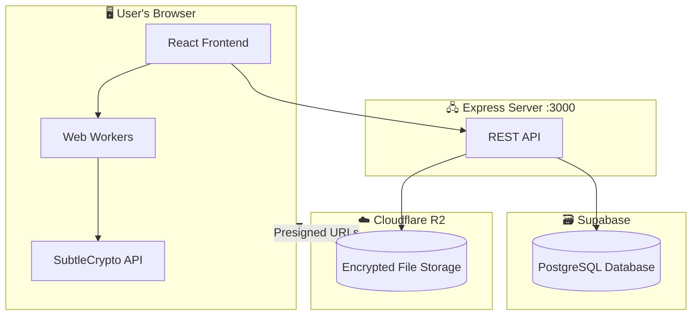
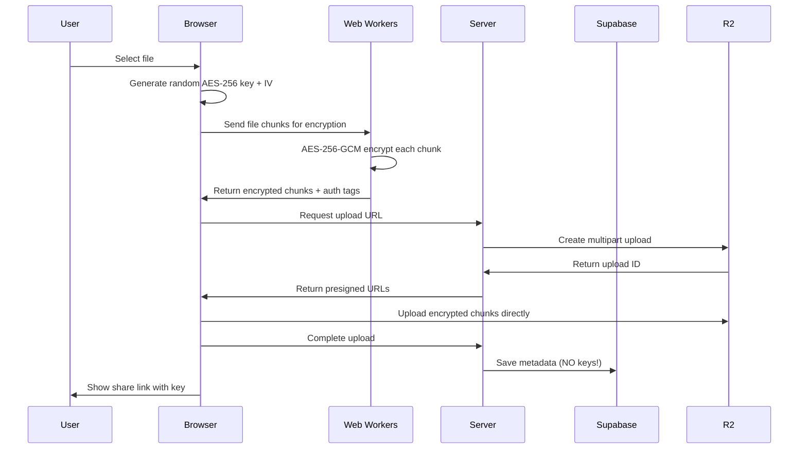
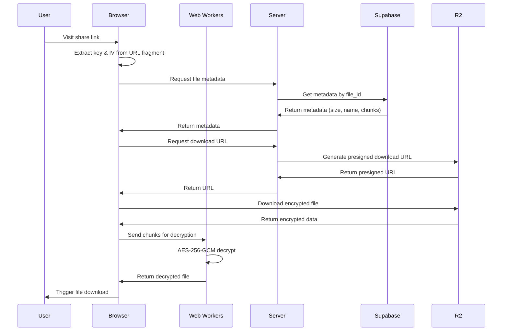

# SecureShare Architecture

## Overview

SecureShare is a **zero-knowledge file sharing service**. "Zero-knowledge" means the server **never sees your unencrypted files or encryption keys**. Everything is encrypted in your browser before it leaves your device.

---

## System Components



---

## What Each Service Does

| Service | Role | Stores |
|---------|------|--------|
| **React Frontend** | User interface, encryption/decryption | Nothing permanent |
| **Express Server** | API gateway, presigned URLs, cleanup | No file data |
| **Supabase** | Metadata database | File info (NOT the files) |
| **Cloudflare R2** | Object storage | Encrypted blobs only |

---

## The Zero-Knowledge Flow

### 📤 Upload Flow



**Key Points:**
1. The **encryption key is NEVER sent to the server**
2. The key exists only in the **URL fragment** (`#key=xxx&iv=xxx`)
3. URL fragments are **never sent to servers** by browsers
4. R2 receives only **encrypted blobs** it cannot read

---

### 📥 Download Flow



---

## Supabase: Metadata Only

Supabase stores **file metadata** in a `files` table:

| Column | Type | Description |
|--------|------|-------------|
| `file_id` | UUID | Unique identifier |
| `original_name` | TEXT | Original filename |
| `file_type` | TEXT | MIME type |
| `file_size` | BIGINT | Size in bytes |
| `storage_path` | TEXT | R2 object key |
| `storage_backend` | TEXT | Always "r2" |
| `chunk_count` | INTEGER | Number of chunks |
| `chunk_sizes` | JSONB | Size of each chunk |
| `expires_at` | TIMESTAMP | Auto-deletion time |
| `created_at` | TIMESTAMP | Upload time |
| `download_count` | INTEGER | Times downloaded |

> ⚠️ **Notice:** No encryption key, no IV, no auth tags stored here!

---

## Cloudflare R2: Encrypted Storage

R2 stores the **encrypted file blobs**:

```
files/
  ├── abc123.enc      ← Encrypted file (small, single chunk)
  ├── def456.enc      ← Encrypted file (large, multipart)
  └── ... 
```

**What's inside each .enc file:**
```
[Encrypted Chunk 1][Auth Tag 1][Encrypted Chunk 2][Auth Tag 2]...
```

- Each chunk is AES-256-GCM encrypted
- Each auth tag is 16 bytes (verifies integrity)
- Without the key (in URL fragment), this is random noise

---

## The Share URL Structure

```
https://example.com/share/abc123#key=64chars&iv=24chars
                          ↑           ↑
                    File ID     Encryption keys (never sent to server)
```

| Part | Sent to Server? | Purpose |
|------|-----------------|---------|
| `/share/abc123` | ✅ Yes | Identifies which file |
| `#key=...&iv=...` | ❌ No | Decryption keys (browser only) |

---

## File Size Handling

| File Size | Upload Method | Chunk Size |
|-----------|---------------|------------|
| < 5MB | Simple PUT | Single chunk |
| 5MB - 100MB | Multipart | 5MB chunks |
| 100MB - 1GB | Multipart | 50MB chunks |
| 1GB+ | Multipart | 100MB chunks |

---

## Encryption Details

| Property | Value |
|----------|-------|
| Algorithm | AES-256-GCM |
| Key Size | 256 bits (32 bytes) |
| IV Size | 96 bits (12 bytes) |
| Auth Tag | 128 bits (16 bytes) |
| Implementation | Web Crypto API (SubtleCrypto) |

**Why AES-256-GCM?**
- **Authenticated encryption**: Detects tampering
- **Hardware acceleration**: Fast on modern CPUs
- **Browser native**: No external crypto libraries needed

---

## Directory Structure

```
📁 secure-share/
├── 📁 server/
│   ├── index.js        ← Express API server
│   └── r2.js           ← R2 client (S3 SDK)
├── 📁 src/
│   ├── 📁 pages/
│   │   ├── HomePage.jsx   ← Upload UI
│   │   └── SharePage.jsx  ← Download UI
│   ├── 📁 utils/
│   │   ├── streamingEncryption.js  ← Encryption orchestration
│   │   ├── fileChunker.js          ← File.slice() chunking
│   │   ├── workerPool.js           ← Worker management
│   │   └── r2Upload.js             ← R2 upload/download client
│   └── 📁 workers/
│       └── encryptionWorker.js     ← Actual crypto operations
└── .env                  ← Credentials (never commit!)
```

---

## Security Model

### What the Server Knows:
- File exists with ID `abc123`
- Original filename: `report.pdf`
- Size: 50MB
- Expires: tomorrow
- Location in R2: `files/abc123.enc`

### What the Server CANNOT Know:
- File contents
- Encryption key
- Whether file is a PDF, photo, or video (content-wise)

### Attack Scenarios:
| Attack | Protected? | How |
|--------|------------|-----|
| Server compromise | ✅ | No keys stored |
| Database leak | ✅ | Only metadata |
| R2 breach | ✅ | Files are encrypted |
| Man-in-middle | ✅ | Keys in fragment (not sent) |
| Brute force key | ✅ | 256-bit = 2^256 combinations |

---

## Next Steps

1. **Automatic Cleanup**: Cron job to delete expired files
2. **Upload Resumability**: Resume interrupted uploads
3. **UI Improvements**: Your custom changes

